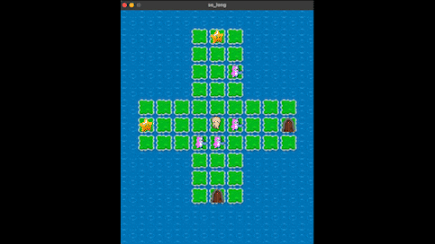
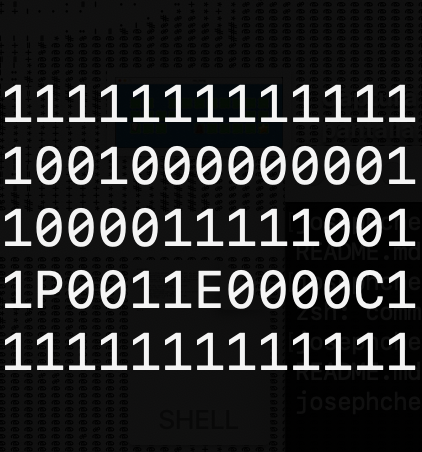
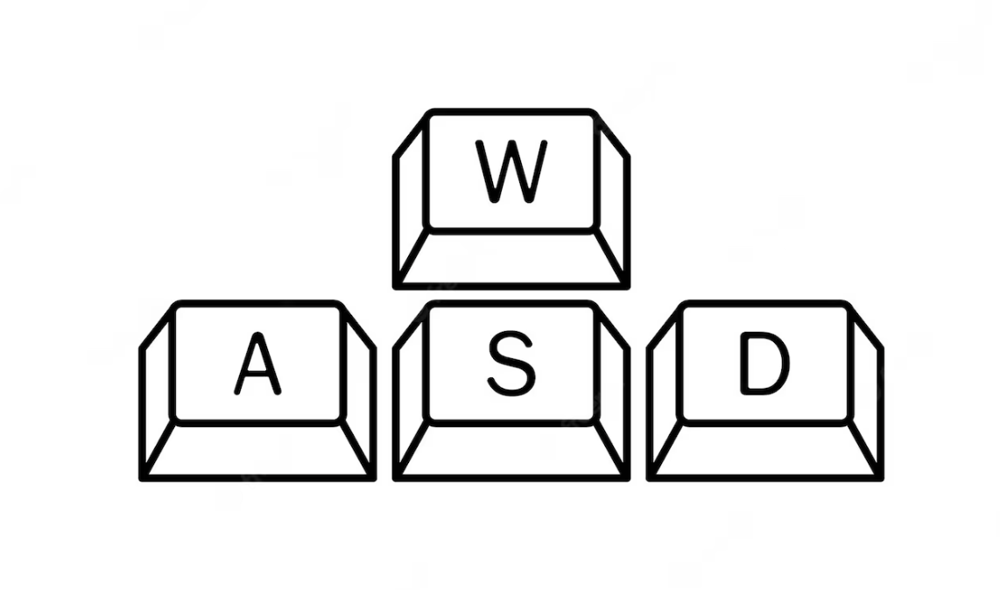
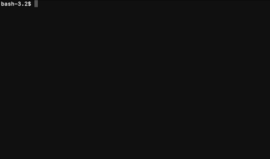

<h1 align="center"> So_long | 
 
 Cursus 

 <picture>
    <source media="(prefers-color-scheme: light)" srcset="https://raw.githubusercontent.com/Mqxx/GitHub-      Markdown/main/blockquotes/badge/light-theme/complete.svg">
  
 
  </picture>
  
</h1>


> A project involving the creation of a ***small 2D game*** with a graphical library. Using MiniLibX, the 42 graphical library.

<div align="center">

</div>
<br>
<br>
 
 
### What is the the project about

 This project is about creating a 2D game, which you can interact with your keyboard! The task has two parts: the **mandatory** and the **bonus**. Each of these parts is compiled and execute separately. The bonus has the same features plus some extra.

## General Instrucctions

* Makefile will compile your source files. Must have **'all'** and **'bonus'** rules for Mandatory and Bonus respectively. It must not relink.
* Must use MiniLibX
* Program should compile as follows:
 
```shell
> ./so_long map.ber
> ./so_long_bonus map.ber
```
> <picture>
>   <source media="(prefers-color-scheme: light)" srcset="https://raw.githubusercontent.com/Mqxx/GitHub-Markdown/main/blockquotes/badge/light-theme/warning.svg">
>   
> </picture><br>
>
> Map must have the ***.ber*** extension

## Mandatory Instrucctions
* Number of movements must be displayed in the shell.
* ESC or  must close the window and quit the program.



* The map has to be constructed with 5 components: **walls**, **collectibles**(one minimum), **empty space**, **exit**(one minimum) and **player**(only one). These are the 5 Characters that a map is composed:
  * **0** for an empty space
  * **1** for a wall
  * **C** for a collectible
  * **E** for a map exit
  * **P** for the player’s starting position



* <kbd>W</kbd> <kbd>A</kbd> <kbd>S</kbd> <kbd>D</kbd> keys must be used to move the main character:
  * <kbd>W</kbd> to go up ↑
  * <kbd>S</kbd> to go down ↓
  * <kbd>D</kbd> to go right ➞
  * <kbd>A</kbd> to go left ←

## Bonus Instrucctions

* Add **X** to the map for spawn patrols 
* Make the player lose when they touch an enemy patrol
* Add some sprite animation. 
* Display the movement count directly on screen instead of writing it in the shell.
 
### How to compile it
> Compilation is done through makefile rules.


<div align="center">

</div>

* If you use <kbd>make</kbd> command it will appear the ***./so_long*** executable file.
* You can use <kbd>make bonus</kbd> command and it will appear ***./so_long_bonus*** executable file

```shell
> make
> make bonus
```


[//]: <> (<h3> <a href="https://github.com/JaeSeoKim/badge42"></a></h3>)

[//]: <> (### | A project involving the creation of a small 2D game using a graphical library.)

[//]: <> (#### How it works)

[//]: <> (#### How to use it)
