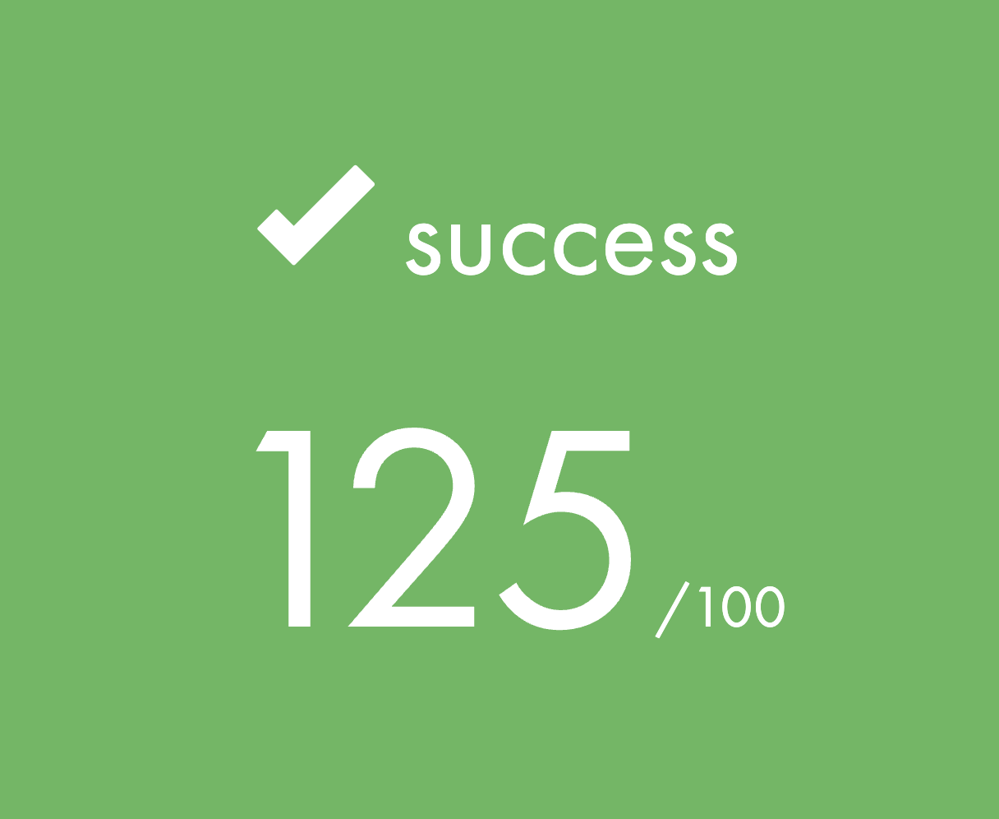

<h1 align="center">So_long | 42 Cursus 
 <picture>
    <source media="(prefers-color-scheme: light)" srcset="https://raw.githubusercontent.com/Mqxx/GitHub-      Markdown/main/blockquotes/badge/light-theme/complete.svg">
  
  </picture>
</h1>

> A project involving the creation of a ***small 2D game*** using a graphical library. Using MiniLibx, the 42 graphical library.

 
 
### What is the the project about
The project has two parts: the **mandatory** and the **bonus**.


```

```

<h3> <a href="https://github.com/JaeSeoKim/badge42"></a></h3>


[//]: <> (### | A project involving the creation of a small 2D game using a graphical library.)


#### How it works

#### How to use it

[//]: <> (#### How to compile)

> <picture>
>  <source media="(prefers-color-scheme: light)" srcset="https://github.com/Mqxx/GitHub-Markdown/blob/main/blockquotes/badge/light-theme/warning.svg">
>   
> </picture><br>
>
> Warning

> <picture>
>   <source media="(prefers-color-scheme: light)" srcset="https://raw.githubusercontent.com/Mqxx/GitHub-Markdown/main/blockquotes/badge/light-theme/info.svg">
>   
> </picture><br>
>
> Info


> <picture>
>   <source media="(prefers-color-scheme: light)" srcset="https://raw.githubusercontent.com/Mqxx/GitHub-Markdown/main/blockquotes/badge/light-theme/success.svg">
>   
> </picture><br>
>
> Success


> <picture>
>   <source media="(prefers-color-scheme: light)" srcset="https://raw.githubusercontent.com/Mqxx/GitHub-Markdown/main/blockquotes/badge/light-theme/solution.svg">
>   
> </picture><br>
>
> Solution

> <picture>
>   <source media="(prefers-color-scheme: light)" srcset="https://raw.githubusercontent.com/Mqxx/GitHub-Markdown/main/blockquotes/badge/light-theme/check.svg">
>   
> </picture><br>
>
> Check

> <picture>
  <source media="(prefers-color-scheme: light)" srcset="https://raw.githubusercontent.com/Mqxx/GitHub-Markdown/main/blockquotes/badge/light-theme/complete.svg">
  
> </picture><br>
>
> Complete

Use <kbd>Ctrl</kbd>+<kbd>S</kbd> to save your file.

[//]: <> (###### with textures, sprites, and some other very basic gameplay elements. Version: 2.3)

